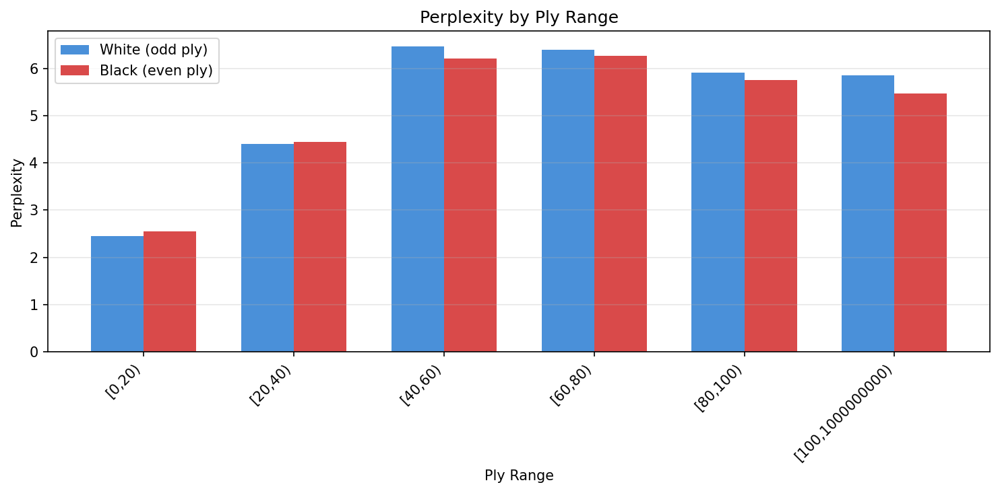
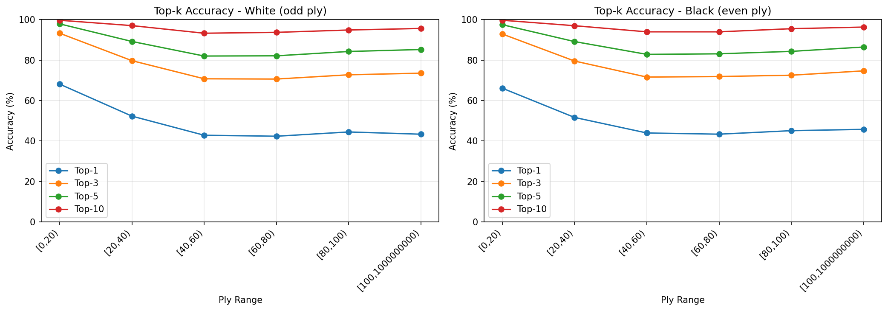
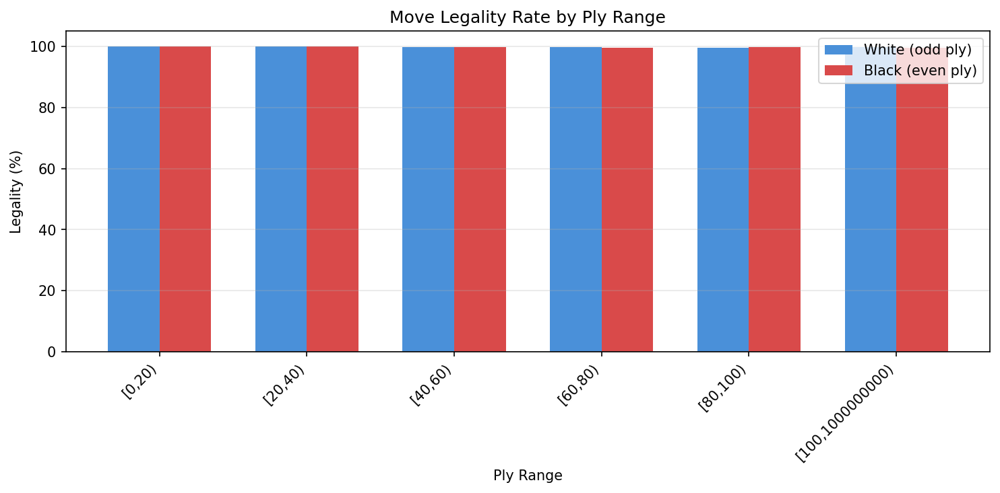

# Evaluation Report: gamba_rossa

**Generated:** 2026-01-15T19:17:18.583628

## Metadata

| Property | Value |
|----------|-------|
| Model | `gamba_rossa` |
| Data | `data/carlsen_games/shard_00000.npz` |
| Device | cpu |
| Batch Size | 32 |
| Max Games | 1500 |

---

## Overall Summary

| Metric | Value |
|--------|-------|
| Total Tokens | 134,561 |
| Perplexity | 4.67 |
| Legality Rate | 99.85% |

### Top-k Accuracy

| k | Accuracy |
|---|----------|
| 1 | 50.75% |
| 3 | 78.39% |
| 5 | 87.90% |
| 10 | 96.18% |

---

## Metrics by Ply Range

### Perplexity

### Top-k Accuracy

### Detailed Metrics Table

| Ply Range | Side | Tokens | Perplexity | Top-1 Acc |
|-----------|------|--------|------------|-----------|
| [0,20) | White | 14,991 | 2.45 | 68.13% |
| [0,20) | Black | 14,989 | 2.55 | 66.12% |
| [20,40) | White | 14,844 | 4.41 | 52.30% |
| [20,40) | Black | 14,835 | 4.45 | 51.66% |
| [40,60) | White | 13,724 | 6.46 | 42.85% |
| [40,60) | Black | 13,630 | 6.21 | 43.98% |
| [60,80) | White | 10,506 | 6.40 | 42.37% |
| [60,80) | Black | 10,349 | 6.27 | 43.38% |
| [80,100) | White | 6,452 | 5.91 | 44.48% |
| [80,100) | Black | 6,275 | 5.75 | 45.12% |
| [100,1000000000) | White | 7,094 | 5.85 | 43.36% |
| [100,1000000000) | Black | 6,872 | 5.47 | 45.77% |

---

## Legality Analysis

The legality rate measures the percentage of greedy (argmax) predictions that are legal chess moves.

### Overall Legality

| Metric | Value |
|--------|-------|
| Total Moves | 134,561 |
| Legal Moves | 134,365 |
| Illegal Moves | 196 |
| Legality Rate | 99.85% |

### Legality by Ply Range

| Ply Range | Side | Moves | Legality |
|-----------|------|-------|----------|
| [0,20) | White | 14,991 | 100.00% |
| [0,20) | Black | 14,989 | 99.99% |
| [20,40) | White | 14,844 | 99.99% |
| [20,40) | Black | 14,835 | 99.95% |
| [40,60) | White | 13,724 | 99.88% |
| [40,60) | Black | 13,630 | 99.83% |
| [60,80) | White | 10,506 | 99.77% |
| [60,80) | Black | 10,349 | 99.64% |
| [80,100) | White | 6,452 | 99.69% |
| [80,100) | Black | 6,275 | 99.79% |
| [100,1000000000) | White | 7,094 | 99.70% |
| [100,1000000000) | Black | 6,872 | 99.53% |

---

*Report generated by `tools/generate_report_markdown.py`*
